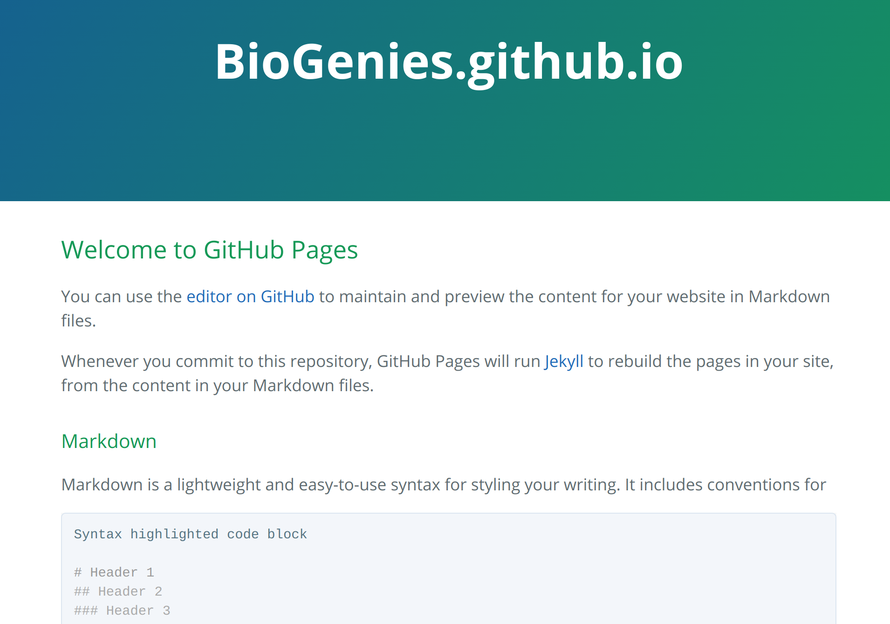
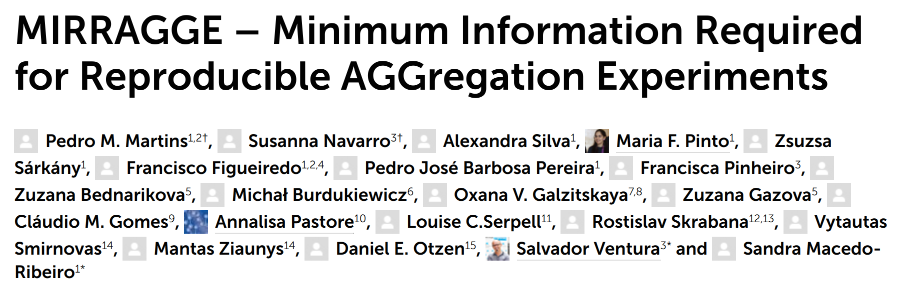

<link href="https://fonts.googleapis.com/css?family=Montserrat&display=swap" rel="stylesheet">

# Organizacyjnie

## Logo

Gdzie jest moja identyfikacja graficzna? 
 - logo,
 - temat dla prezentacji,
 - temat dla posterów.
 
Wybierzmy logo do końca roku.

## Komunikacja

Myślimy bardzo o mattermost **i mamy już licencję**.

## Strona

Mamy biogenies.info: http://biogenies.info/

## Biologia dla nie-biologów

Nie było w grudniu, ale nadejdzie na początku 2021.

## Journal club

Nie wiem jak to zrobić, aby się odbywał często a nie był za dużym obciążeniem.

# Podsumowania

## Artykuły

AmpGram i CancerGram - dzięki Kasi Sidorczuk w końcu mamy elastyczny pipeline w drake do budowania modeli przewidujących właściwości białek.

## Artykuły cd.

HaDeX: największy punktowo sukces w tym roku dzięki Weronice Puchale.

## Artykuły cd. 

## Granty

Pięć złożonych, jeden otrzymany.

## Infrastrukura

Jakub Kała okiełznał klaster z IBB.

# Perspektywy

## Jeszcze więcej publikować

 - tidysq!
 - zbiory negatywne,
 - baza PhyloPlas,
 - przeglądówka HR-HDX,
 - test HR-HDX,
 - AmyloGram 2.0.

## Jeszcze więcej ML

Jeszcze lepsze modele: AmyloGram 2.0, AmpGram 2.0 (jeśli zdążymy). 

Zacząć wykorzystywać MBO.

Rozpocząć prace z nowymi reprezentacjami danych.

Model ensambles/stacking.

## Mniej MDPI

Jest szybko, ale chcę publikować więcej w innych miejscach.

## Amyloidy

Bardziej skupić się na pracach amyloidowych.

## Wyjazdy integracyjne

Wyjechać dwa razy w tym roku.
