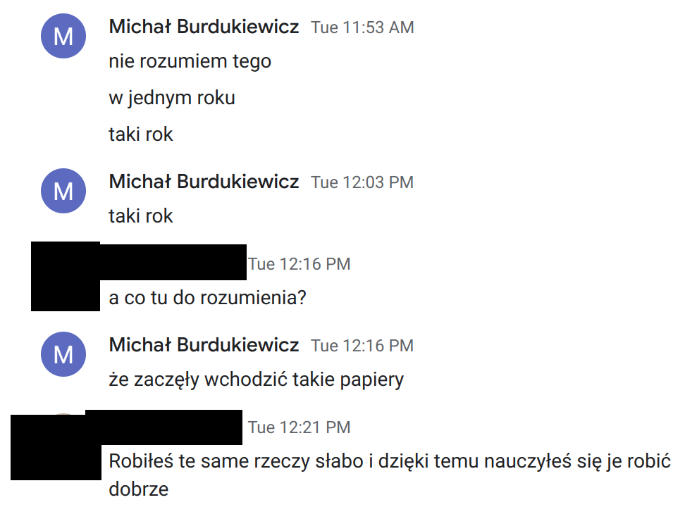
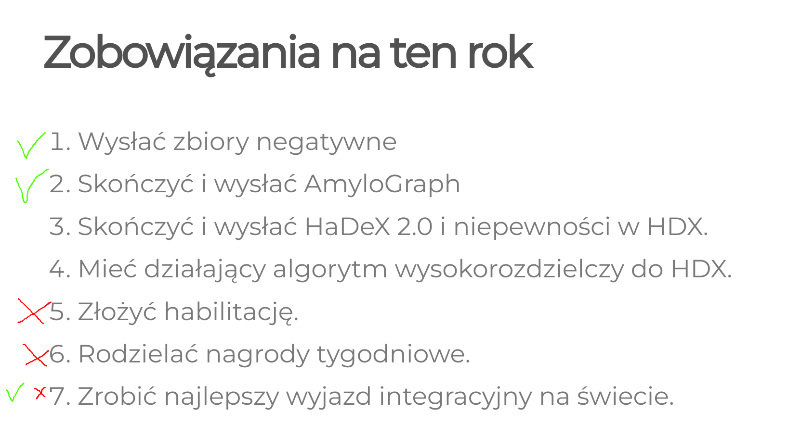

<link href="https://fonts.googleapis.com/css?family=Montserrat&display=swap" rel="stylesheet">

<style>
slides > slide {
font-family: 'Montserrat', sans-serif;
}

.center {
display: block;
margin-left: auto;
margin-right: auto;

}


</style>

# What happened?

## I have started publishing

Yes, I have had published a few (32) manuscripts in the past, but they were *average* (with a single exception).

This year I have pulled off two papers in more prestigious venues.

## I have started publishing

```{r,echo=FALSE}
library(ggplot2)
library(RColorBrewer)
library(ggiraph)

interactive_plot <- function(x) {
  pg <- girafe(ggobj = x, height_svg = 3, width_svg = 6)
  
  pg <- girafe_options(pg, opts_zoom(min = 1, max = 5))
  
  pg
}

dat <- read.csv("annotated-pubs.csv")


ggplot(dat, aes(x = year, y = IF, color = leading)) +
  geom_point() +
  geom_hline(yintercept = 10, color = "grey", linetype = "dashed", size = 2) +
  scale_color_manual("Leading author", values = brewer.pal(3, "Set1")) +
  theme_bw() +
  theme(legend.position = "bottom")


```

## Why have I started publishing?

```{r, echo=FALSE}

```

## Why have I started publishing (negative datasets)

```{r,echo=FALSE}

p <- ggplot(dat, aes(x = year, y = IF, color = leading, linetype = NegativeDatasets, tooltip = title, 
                     group = NegativeDatasets)) +
  geom_line(color = "black", show.legend = FALSE) +
  geom_point_interactive() +
  geom_hline(yintercept = 10, color = "grey", linetype = "dashed", size = 2) +
  scale_color_manual("Leading\nauthor", values = brewer.pal(3, "Set1")) +
  scale_linetype_manual(values = c(NA, "solid")) +
  theme_bw() +
  theme(legend.position = "right")

interactive_plot(p)
```

## Why have I started publishing (AmyloGraph)

```{r,echo=FALSE}

p <- ggplot(dat, aes(x = year, y = IF, color = leading, linetype = AmyloGraph, tooltip = title, group = AmyloGraph)) +
  geom_line(color = "black", show.legend = FALSE) +
  geom_point_interactive() +
  geom_hline(yintercept = 10, color = "grey", linetype = "dashed", size = 2) +
  scale_color_manual("Leading\nauthor", values = brewer.pal(3, "Set1")) +
  scale_linetype_manual(values = c(NA, "solid")) +
  theme_bw() +
  theme(legend.position = "right")

interactive_plot(p)
```

## Comparisons - negative datasets

 - 4 years: envisioned length of the doctoral studies in Poland
 - 3.31 years: average post-doc time (10.1371/journal.pone.0263185)
 - Negative datasets:
   - the first group meeting: 29-06-2020.
   - the first meeting 'Przemek + gang + Michał' = AmpGram: 25-10-2019
   - the first e-mail to Przemek and Stefan on the topic on negative data sampling: 05-03-2019.
   - Kasia and I work on the AmpGram: December 2018.
   - First biogram commit: 05-08-2014.

## Comparisons - AmyloGraph

 - 4 years: envisioned length of the doctoral studies in Poland
 - 3.31 years: average post-doc time (10.1371/journal.pone.0263185)
 - AmyloGraph:
   - the first meeting with curators: 08-02-2021.
   - the first meeting with Kasia Hubicka: 25-11-2020.
   - the second grant submission: 15-12-2019.
   - the first grant submission: 14-12-2018.
   - the first graph of interactions: somewhere in 2017.

# Afterthoughts

## Was it worth?

 - Now I'm happy that I did big projects
    - but it was very risky (I did not publish small works, my CV was looking worse)
    - killed me time-wise (no grant application in July, personal life suffered greatly, mini-seizure)
 - each project I stopped loving in the process
    - suddenly the work became very hard
    - it is a consequence of the gap between expectations and reality 
 
## What I have learned?

 - a creative work is really hard to delegate
 
## What I have learned?

 - ~~a creative work is really hard to delegate~~
 - every kind of work is really hard to delegate.
 - discussing the project with other researchers outside the project helps the project to move forward: **the guidance is everything**.
 - I note too little: thanks to that, projects were disorganized.
 - I plan to little: the projects failed to achieve the envisioned impact.
 - people are hard to replace.
 - all unexpected difficulties arisen from the wrong communication with people.
 - Even though we work in a group, I have to deal with my stress nor disappointment on my own.

## What is more for this year?

```{r, echo=FALSE}

```

## What is more for this year?

A lot of seminars, presentations and travelling. Next two weeks I am trying out my presentations.

## What are the next big project?

 - database of peptide predicting tools
 - predictor of AMPs
 - maybe AmyloGraph 2.0?
 
# Thanks
 
## Thank you!

These projects were done only thanks to you, who worked, participated in meetings and conversations, did your best and endured me.
