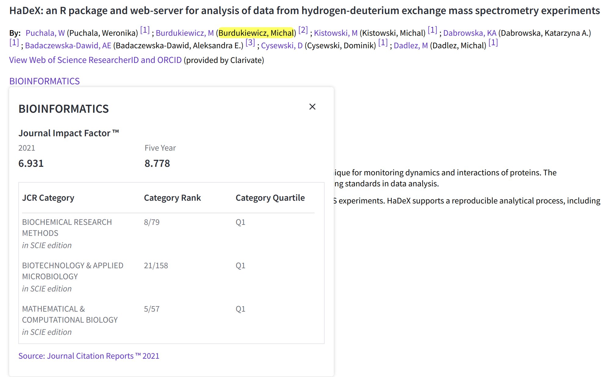

<link href="https://fonts.googleapis.com/css?family=Montserrat&display=swap" rel="stylesheet">

## Why do we publish?

 >- To share with others our latest research
 >- To solve the unsolved
 >- To earn IFs and citations.
 
## What is IF?

Impact Factor: an academic journal is a scientometric index calculated by Clarivate that reflects the yearly mean number of citations of articles published in the last two years in a given journal, as indexed by Clarivate's Web of Science.

Source: Wikipedia

## What is Clarivate?

https://www.webofscience.com/wos/woscc/full-record/WOS:000606794200020

## How to see IFs?

## When do you need IF?

 >- always
 >- but especially when you apply for grants
 >- or for habilitation
 >- or for a job
 >- or you want to boast
 >- or you want to do anything

## How do I rate IFs?

 >- The higher the better, but good and well-respected journals can have low IFs.
 >- Field-specific journals always tend to have lower IFs.
 >- Some disciplines have lower IFs than others.
 
## Ministry points

Ministry points (punkty ministerialne) are assigned by the Ministry's experts to journals. 

Scientific institutions in Poland are graded using ministry points.

## Ministry points

Five levels: 0, 40, 70, 100, 140, 200 (the higher the better).

Check points here: https://czasopisma.webclass.co/

Full list: https://www.gov.pl/web/edukacja-i-nauka/komunikat-ministra-edukacji-i-nauki-z-dnia-1-grudnia-2021-r-w-sprawie-wykazu-czasopism-naukowych-i-recenzowanych-materialow-z-konferencji-miedzynarodowych

## Why points are important?

Each full-time researcher can contribute during the 4-year-long evaluation period up to 4 scientific articles. Thus, each researches can contribute up to 800 points.

