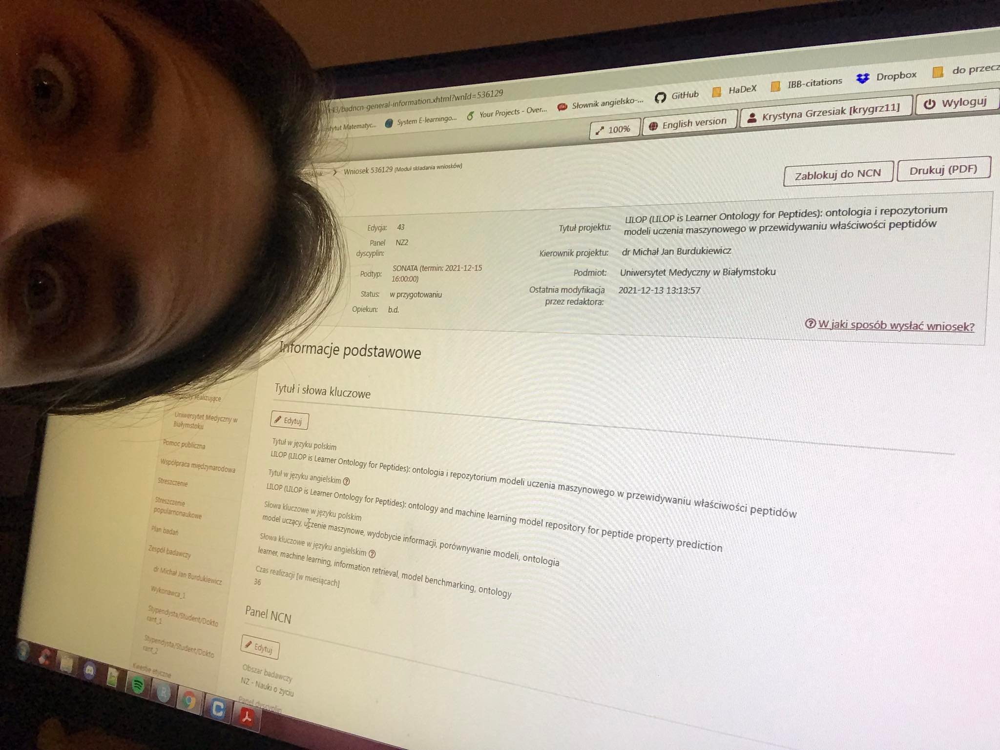
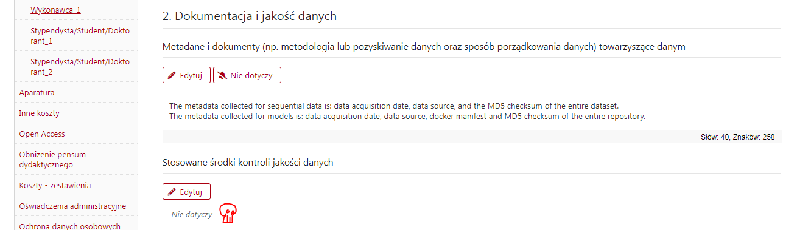

<link href="https://fonts.googleapis.com/css?family=Montserrat&display=swap" rel="stylesheet">

# Organizacyjnie

## Logo

Gdzie jest moja identyfikacja graficzna? 

 - logo,
 - temat dla prezentacji,
 - temat dla posterów.
 
Ale **Dominik** zrobił genialne tło dla AmyloGraphu i może tak trzeba (?).

## Komunikacja

Zostaje chanty.

## Strona

Mamy biogenies.info: http://biogenies.info/

I nigdy tego nie ruszyłem!

## Journal club

Nie wiem jak to zrobić, aby się odbywał często a nie był za dużym obciążeniem.

# Podsumowania

## Granty

Krysia umie w OSF

---
### Zaskakujące (albo nie) rzeczy:

- Wszystko zajmuje więcej czasu niż by się wydawało

- Doświadczenie jest ważne

- nikt się za Was niczego nie dowie (szczególnie nie panie z biura obsługi projektów)

- terminy wewnętrzne to ściema

- 15, 5 i 1 strona to zawsze za mało

- tyle interpretacji regulaminów NCNu ile uczelni

## Granty

Złożyłem wszystkie zaplanowane granty (Lider, OPUS, stypendium Bekkera, Sonata) i niezaplanowane (stypendium Marii Zambrano).

Jeden z nich dostałem!

## Publikacje

Strasznie źle, każdy projekt się przeciągnął. Nie umiem egzekwować od siebie deadlineów i za dużo biorę na siebie. 

Łącznie: 7 publikacji w 2021, w tym jedna super ważna (pierwszoautorski countfiteR Jarka).

## Sukcesy

 - Laura i Dominik już po inżynierce
 - Jarek ma pierwszoautorski papier
 - zbiory negatywne u wewnętrznych recenzentów
 - mam w końcu grant
 - mam w końcu patent

## Porażki

 - Weronika bez publikacji w tym roku
 - Krystyna bez publikacji w ogóle
 - AmyloGraph wciąż w pracach
 - PhyloPlas wciąż w pracach
 - brak finansowania na innych
