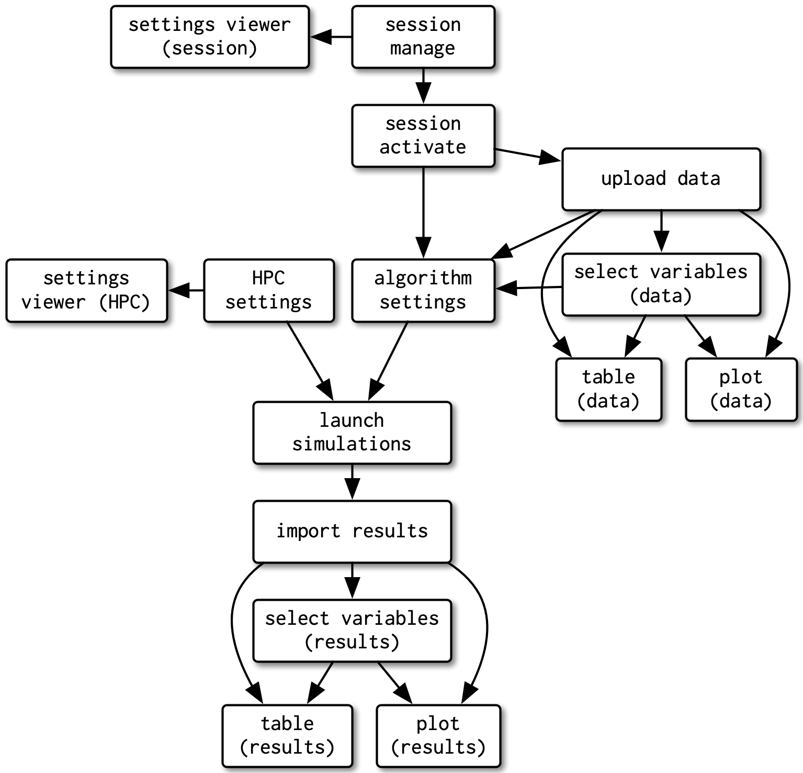
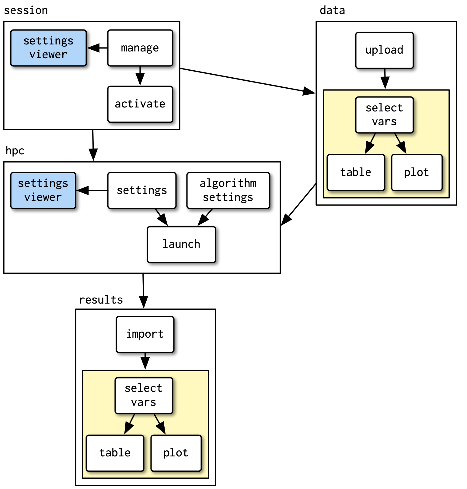

```{r setup, include=FALSE}
knitr::opts_chunk$set(echo = FALSE)
```

## Agenda

> - What is `{golem}` 
> - Why it's so super cool
> - How to `{golem}` (AKA *Demo pt. I*)
> - What are `{shiny}` modules 
> - Why they're so super cool
> - How to modules (AKA *Demo pt. II, Revenge of the Golem*)
> - Summary

## Introducing: `{golem}`

- A framework for building production-grade shiny applications.
- Idea: every shiny application should be built as an R package
- Okay, but: *why* and *how*?

## Why package?

- It has **metadata**: name, author name, version, etc.
- It handles **dependencies**: no longer forgotten imports.
- It's **split into functions**: helps *maintainability* and *readability*.
- It has **documentation**: self-explanatory.
- It’s **tested**: CI standards.

## How to achieve that?

Really simple!

```
install.packages("golem")
```

then create a new project with `{golem}` framework and go step by step with stuff in `dev` catalogue.

## Live demo, S01E01

Let's get the party started!

## Slide with R Output

## A new guest: `{shiny}` modules!

A visual example from [2] about to go.

## Before




## After



## Idea behind modules:

- The app is divided up into pieces and each piece has a name. 
- Names are scoped with namespaces.
- Each module is a black box with defined inputs and outputs. 
- Modules don't interfere directly with each other.
- Modules are reusable.

## Before we go

**Disclaimer:** You can use modules without using `{golem}`. It's just easier to combine both of those best practices. 

## Live demo, S01E02

Let's push our `{golem}` example further!

## Sources

[[1] Engineering Production-Grade Shiny Apps](https://engineering-shiny.org/index.html)

[[2] Mastering Shiny :: Shiny Modules](https://mastering-shiny.org/scaling-modules.html)

